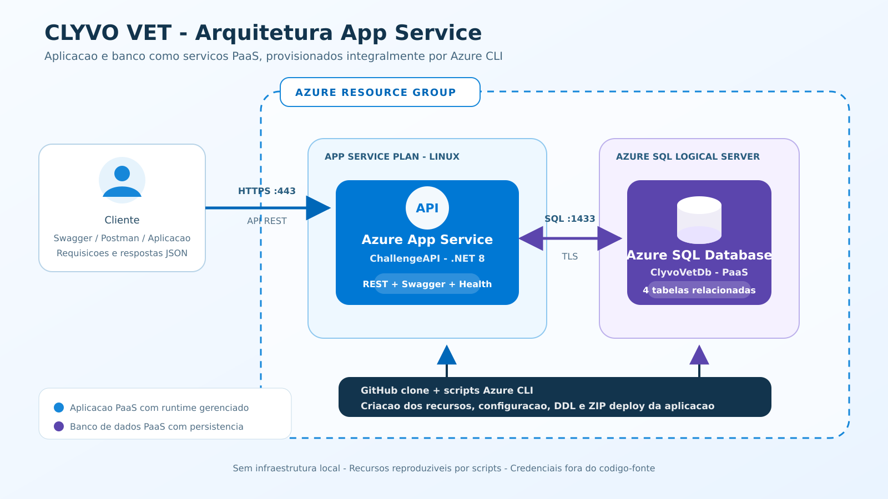
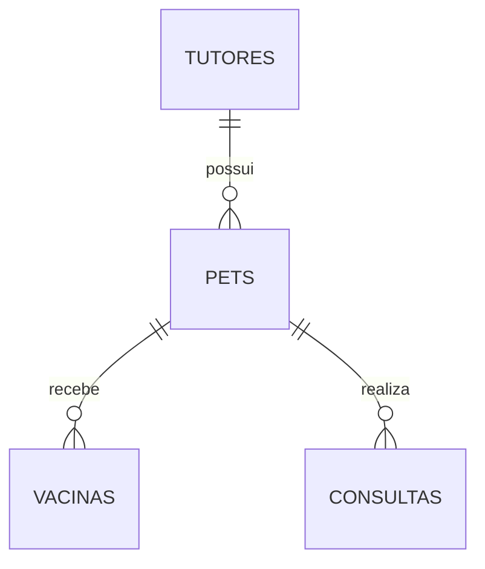

# CLYVO VET - ChallengeAPI

API REST para a gestao da jornada continua de saude dos pets, publicada como
codigo no Azure App Service e integrada a um Azure SQL Database PaaS.

> Entrega escolhida: Servico de Aplicativo (App Service). A aplicacao utiliza o
> runtime nativo .NET 8 do App Service e o banco e um servico PaaS.

## Descricao da solucao

A CLYVO VET centraliza tutores, pets, vacinas e consultas veterinarias. A API
permite incluir, consultar, alterar e excluir registros, mantendo os dados de
saude relacionados ao pet e ao seu responsavel.

## Beneficios para o negocio

| Beneficio | Impacto |
|---|---|
| Historico longitudinal | Clinicas consultam a jornada do pet em um unico lugar |
| Cuidado preventivo | Vacinas e consultas registradas ajudam a reduzir atrasos |
| Maior recorrencia | Acompanhamentos programados aumentam o retorno a clinica |
| Decisao clinica | O historico estruturado apoia atendimentos mais completos |
| Disponibilidade em nuvem | A API e o banco podem ser acessados sem infraestrutura local |

## Arquitetura Azure



Todos os recursos ficam no mesmo Resource Group e sao criados por Azure CLI:

- App Service Plan Linux;
- Azure App Service com runtime nativo .NET 8;
- Azure SQL logical server;
- Azure SQL Database;
- regras de firewall e configuracao segura da connection string.

O cliente acessa a API por HTTPS. O App Service le a connection string das
configuracoes protegidas do proprio servico e se comunica com o Azure SQL.

## Modelo de dados



As tabelas `Tutores`, `Pets`, `Vacinas` e `Consultas` representam o core da
solucao. O arquivo [`scripts/script_bd.sql`](scripts/script_bd.sql) contem o DDL
comentado, chaves primarias, chaves estrangeiras, indices e cinco registros
significativos por tabela.

## Tecnologias

- ASP.NET Core 8;
- Entity Framework Core 8 com provider SQL Server;
- Azure App Service Linux;
- Azure SQL Database;
- Azure CLI;
- Swagger/OpenAPI e Scalar;
- Serilog e OpenTelemetry;
- xUnit, Moq e EF Core InMemory.

## Estrutura do repositorio

```text
ChallengeAPI/
|-- Controllers/                 endpoints REST
|-- Data/                        DbContext do Entity Framework
|-- Models/                      entidades do dominio
|-- Telemetry/                   metricas e tracing
|-- ChallengeAPI.UnitTests/      testes unitarios
|-- ChallengeAPI.IntegrationTests/
|-- docs/
|   |-- arquitetura-app-service.png
|   |-- arquitetura-app-service.svg
|   `-- roteiro-video.md
|-- scripts/
|   |-- 00_config.sh
|   |-- 01_create-resource-group.sh
|   |-- 02_create-app-service.sh
|   |-- 03_create-azure-sql.sh
|   |-- 04_initialize-database.sh
|   |-- 05_deploy-app-service.sh
|   |-- 06_test-crud.sh
|   |-- 99_delete-azure.sh
|   `-- script_bd.sql
|-- ChallengeAPI.csproj
|-- ChallengeAPI.sln
|-- Program.cs
`-- README.md
```

## Rotas principais

| Recurso | GET | POST | PUT | DELETE |
|---|---|---|---|---|
| Tutores | `/api/Tutores` | `/api/Tutores` | `/api/Tutores/{id}` | `/api/Tutores/{id}` |
| Pets | `/api/Pets` | `/api/Pets` | `/api/Pets/{id}` | `/api/Pets/{id}` |
| Vacinas | `/api/Vacinas` | `/api/Vacinas` | `/api/Vacinas/{id}` | `/api/Vacinas/{id}` |
| Consultas | `/api/Consulta` | `/api/Consulta` | `/api/Consulta/{id}` | `/api/Consulta/{id}` |

Outras rotas de pesquisa ficam documentadas no Swagger.

## How To - deploy completo

Os passos abaixo devem ser seguidos nesta mesma ordem durante a gravacao. Eles
podem ser executados no Azure Cloud Shell (Bash) ou em um terminal Bash com as
ferramentas instaladas.

### 1. Pre-requisitos

- assinatura Azure ativa;
- Git e Azure CLI;
- .NET SDK 8;
- `zip`, `curl` e `jq`;
- `sqlcmd`.

O `sqlcmd` esta disponivel por padrao no Azure Cloud Shell. Documentacao:
[instalar e usar sqlcmd](https://learn.microsoft.com/sql/tools/sqlcmd/sqlcmd-download-install).

### 2. Comecar pelo clone do GitHub

```bash
git clone https://github.com/Challenge2026-2TDSPI/ChallengeAPI.git
cd ChallengeAPI
chmod +x scripts/*.sh
az login
```

No Cloud Shell, o login ja costuma estar associado a conta selecionada.

### 3. Conferir os nomes dos recursos

O RM do representante ja esta configurado como `rm563304`. Para usar outro RM
ou uma regiao permitida pela assinatura, exporte antes de executar os scripts:

```bash
export RM=rm563304
export LOCATION=eastus
source scripts/00_config.sh
print_configuration
```

Os nomes globais do App Service e do SQL Server usam o numero do RM como sufixo.

### 4. Criar o Resource Group

```bash
./scripts/01_create-resource-group.sh
```

### 5. Criar o App Service

```bash
./scripts/02_create-app-service.sh
```

Esse script cria o App Service Plan Linux e o Web App com `DOTNETCORE:8.0`.

### 6. Criar o Azure SQL e configurar a integracao

Defina uma senha forte apenas na sessao atual. Ela nao sera escrita no
repositorio nem no `appsettings.json`:

```bash
read -r -s -p "Senha forte do Azure SQL: " SQL_ADMIN_PASSWORD
echo
export SQL_ADMIN_PASSWORD
./scripts/03_create-azure-sql.sh
```

O script cria o servidor e o banco PaaS, configura as regras de rede e grava a
connection string nas configuracoes protegidas do App Service.

### 7. Criar as tabelas e os dados iniciais

```bash
./scripts/04_initialize-database.sh
```

Ao final devem aparecer cinco registros em cada uma das quatro tabelas.

### 8. Testar, publicar e implantar a API

```bash
./scripts/05_deploy-app-service.sh
```

O script executa `dotnet restore`, `dotnet test` e `dotnet publish`, gera um ZIP
com os binarios publicados e usa `az webapp deploy`. O pacote nao deve conter
uma pasta superior: os arquivos publicados ficam diretamente na raiz do ZIP,
como exige o ZIP deploy do App Service.

Ao concluir:

```text
https://clyvovet-api-563304.azurewebsites.net/swagger
https://clyvovet-api-563304.azurewebsites.net/scalar
https://clyvovet-api-563304.azurewebsites.net/health
```

### 9. Demonstrar o CRUD e a persistencia

Execute sem cortes:

```bash
./scripts/06_test-crud.sh
```

O script demonstra, individualmente, em duas tabelas relacionadas:

1. `INSERT` de Tutor pela API e `SELECT` direto no banco;
2. `INSERT` de Pet relacionado e `SELECT` direto no banco;
3. `UPDATE` de Tutor e de Pet, cada um seguido de `SELECT`;
4. `GET` dos dois registros pela API;
5. `DELETE` de Pet e Tutor, cada um seguido de `SELECT` sem linhas.

Tambem e possivel acompanhar os dados pelo Query Editor do Azure SQL no portal.

### 10. Consultar logs, se necessario

```bash
source scripts/00_config.sh
az webapp log tail --resource-group "$RESOURCE_GROUP" --name "$WEBAPP_NAME"
```

### 11. Remover os recursos depois da avaliacao

O Azure SQL pode gerar custo enquanto permanecer ativo. Remova o Resource Group
somente depois de concluir o video e confirmar que o professor nao precisa do
ambiente em execucao:

```bash
./scripts/99_delete-azure.sh
```

## Seguranca

- nenhuma senha, token ou connection string real esta versionada;
- a senha e digitada de forma oculta e permanece somente na sessao;
- a connection string de producao e armazenada nas configuracoes do App Service;
- o trafego entre a API e o Azure SQL utiliza criptografia;
- `appsettings.json` contem apenas uma configuracao local sem credenciais.

## Evidencias exigidas no video

O roteiro completo esta em [`docs/roteiro-video.md`](docs/roteiro-video.md). Nao
realize cortes durante os testes da API nem entre uma operacao e o respectivo
`SELECT` no banco.

## Integrantes

| Nome | RM |
|---|---|
| Eduardo Augusto de Oliveira Souza | RM565269 |
| Fellipe Costa de Oliveira | RM564673 |
| Felype Ferreira Maschio | RM563009 |
| Gustavo Vieira de Matos | RM563304 |
| Pedro Henrique dos Santos Costa | RM562156 |

## Disciplina

DevOps Tools & Cloud Computing - Sprint 3 - 2TDS - 2o semestre de 2026.

## Referencias tecnicas

- [Deploy de arquivos no Azure App Service](https://learn.microsoft.com/azure/app-service/deploy-zip)
- [Quickstart do ASP.NET Core no App Service](https://learn.microsoft.com/azure/app-service/quickstart-dotnetcore)
- [Azure CLI para App Service](https://learn.microsoft.com/cli/azure/webapp)
- [Azure CLI para Azure SQL](https://learn.microsoft.com/cli/azure/sql)
