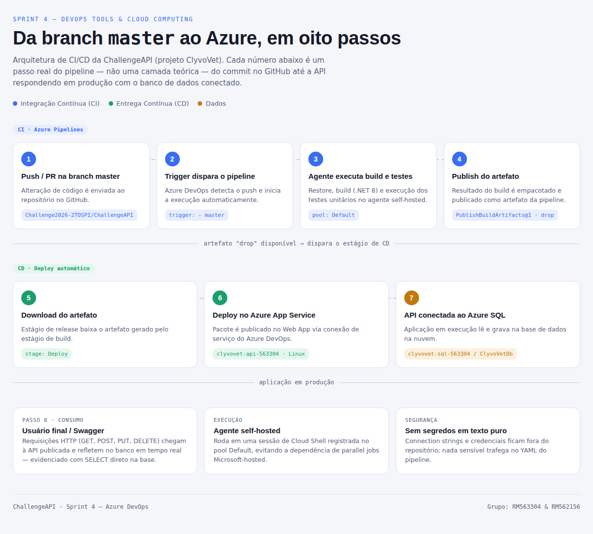

# CLYVO VET — ChallengeAPI

API REST para gestão de saúde de pets. Centraliza tutores, pets, vacinas e consultas veterinárias em um único lugar, permitindo criar, consultar, atualizar e excluir registros e manter o histórico de saúde de cada animal ao longo do tempo.

## O que a aplicação faz

- Cadastro de **tutores** (responsáveis pelos pets).
- Cadastro de **pets**, vinculados a um tutor.
- Registro de **vacinas** aplicadas, com data de aplicação e próxima dose.
- Registro de **consultas** veterinárias.
- CRUD completo (criar, listar, atualizar, excluir) exposto via API REST documentada em Swagger/OpenAPI.

## Stack de tecnologias

| Camada | Tecnologia |
|---|---|
| API | ASP.NET Core 8 (.NET 8) |
| Acesso a dados | Entity Framework Core 8 |
| Banco de dados | Azure SQL Database (PaaS) |
| Hospedagem | Azure App Service (Linux) |
| CI/CD | Azure DevOps Pipelines (YAML) |
| Execução da pipeline | Agente self-hosted (Azure Pipelines Agent) |
| Documentação da API | Swagger / OpenAPI |
| Observabilidade | Serilog + OpenTelemetry |
| Testes | xUnit + Moq |

## CI/CD — Sprint 4 (Azure DevOps)

O deploy desta aplicação é feito por uma pipeline no Azure DevOps, definida em [`azure-pipelines.yml`](./azure-pipelines.yml), disparada automaticamente a cada push na branch `master`.

**Estágio de CI — Build, Test e Publish**
1. Instala o SDK .NET 8 no agente.
2. Restaura as dependências (`dotnet restore`).
3. Compila a solução (`dotnet build`).
4. Executa os testes automatizados do projeto `ChallengeAPI.UnitTests` (`dotnet test`).
5. Publica o build e empacota o artefato (`dotnet publish` + `PublishBuildArtifacts@1`).

**Estágio de CD — Deploy**

Disparado automaticamente assim que o artefato do estágio anterior é gerado com sucesso: baixa o artefato publicado e faz o deploy direto no Azure App Service (`AzureWebApp@1`), sem intervenção manual.

A pipeline roda em um **agente self-hosted** (pool `Default`), o que evita depender da cota gratuita de *parallel jobs* Microsoft-hosted do Azure DevOps.

Nenhuma credencial, senha ou connection string fica em texto puro no repositório ou no YAML da pipeline — o acesso ao Azure é feito através de uma Service Connection configurada no próprio Azure DevOps.

### Arquitetura e fluxo de CI/CD



O fluxo numerado acima cobre desde o push no GitHub até a API respondendo em produção com o banco de dados conectado (detalhe passo a passo na imagem).

## Banco de dados

Azure SQL Database (serviço PaaS), banco `ClyvoVetDb`, com as tabelas `Tutores`, `Pets`, `Vacinas` e `Consultas` relacionadas por chave estrangeira.

## Executando localmente

```bash
dotnet restore
dotnet build
dotnet test
dotnet run --project ChallengeAPI.csproj
```

A connection string do banco é lida de `appsettings.json` (ambiente local) ou das configurações do Azure App Service em produção — nunca versionada com credenciais reais.

## Equipe

| Nome | RM |
|---|---|
| Gustavo Vieira de Matos | RM563304 |
| Pedro Henrique dos Santos Costa | RM562156 |

Disciplina: **DevOps Tools & Cloud Computing** — Sprint 4 — Challenge 2026 — FIAP.
